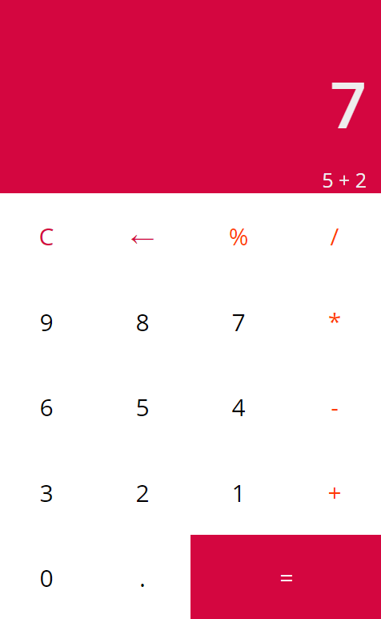

# React Calculator

This project was bootstrapped with [Create React App](https://github.com/facebook/create-react-app).

A simple arithmetic calculator built with REACT.JS library.

To run it on your local machine clone into the repo, then type: 

    npm install && npm start  
    
A sneak peek: 

